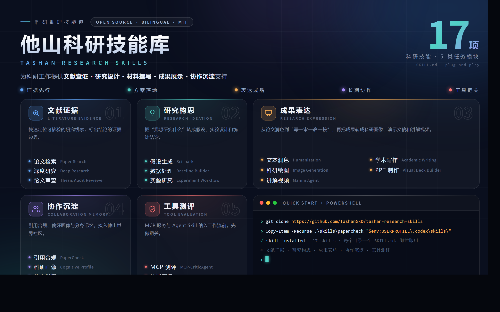

<div align="center">

# 他山科研技能库

**面向 AI 辅助科研的中英双语自包含技能库**

*文献证据 · 研究构思 · 成果表达 · 协作沉淀 · 工具测评*

[简体中文](README.md) · [English](README.en.md)

[](LICENSE)
[](skills/README.md)
[](#技能矩阵)
[](CONTRIBUTING.md)



</div>

---

## 项目概览

他山科研技能库收录 **17 个生产级 agent skills**，覆盖科研工作者的日常任务：查文献、核证据，把想法变成可检验的研究设计，把成果做成论文、图像、PPT 和讲解视频，并沉淀长期协作记忆。每个 skill 都是独立工作流目录，以 `SKILL.md` 为入口，自带脚本、参考文档、模板和测试。

本项目由 **磐石 AI4Science 生态与应用模式研究项目** 支持。

### 设计原则

- **一个技能只管一件科研任务** —— 每个 skill 拥有单一、边界清晰的工作流。
- **证据优先于修辞** —— 技能追踪来源、标注证据边界，不把结论说满。
- **能确定性就不靠模型** —— 解析、随机化、打包、校验都是带测试的普通脚本，模型判断只用在真正需要推理的地方。
- **仓库里没有密钥** —— 所有凭证在运行时从环境变量读取。

## 技能矩阵

### 文献证据

| 技能 | 路径 | 用途 |
| --- | --- | --- |
| 论文检索 | [`skills/giiisp-paper-search-apis`](skills/giiisp-paper-search-apis/SKILL.md) | 基于 Giiisp 和开放论文数据源，快速查找候选文献，并整理可核验的论文列表。 |
| 深度研究 | [`skills/sci-employee-deep-research`](skills/sci-employee-deep-research/SKILL.md) | 围绕研究问题拆关键词、找证据、梳理引用，并标出结论的证据边界。 |
| 论文审查 | [`skills/thesis-audit-reviewer`](skills/thesis-audit-reviewer/SKILL.md) | 审查论文或学位论文中的事实、方法、引用、证据边界和完成度。 |

### 研究构思

| 技能 | 路径 | 用途 |
| --- | --- | --- |
| 假设生成 | [`skills/scispark`](skills/scispark/SKILL.md) | 基于关键词或论文集合生成带证据追踪的研究想法、假设和机制线索。 |
| 数据处理 | [`skills/research-baseline-builder`](skills/research-baseline-builder/SKILL.md) | 把科研问题拆成可处理的数据任务，明确输入、输出、baseline 和评估指标。 |
| 实验设计 | [`skills/experiment-design`](skills/experiment-design/SKILL.md) | 在采集数据之前完成研究设计：设计类型、随机化、样本量、统计功效和分析计划。 |

### 成果表达

| 技能 | 路径 | 用途 |
| --- | --- | --- |
| 文本润色 | [`skills/scientific-humanization`](skills/scientific-humanization/SKILL.md) | 优化中文论文、基金、答辩和讲稿表达，让文字更自然，同时保留事实边界。 |
| 学术写作 | [`skills/academic-writing`](skills/academic-writing/SKILL.md) | 覆盖论文写作、同行评审、审稿回复、基金申请和投稿材料的“写—审—改—投”全流程。 |
| 科研绘图 | [`skills/giiisp-scientific-image-generation`](skills/giiisp-scientific-image-generation/SKILL.md) | 把论文段落、机制描述或实验流程转成科研图像生成任务。 |
| PPT 制作 | [`skills/visual-deck-builder`](skills/visual-deck-builder/SKILL.md) | 把主题、论文、报告或笔记整理成结构清晰、视觉完整的演示文稿。 |
| 讲解视频 | [`skills/manim-agent`](skills/manim-agent/SKILL.md) | 生成数学、公式或技术概念的讲解动画，可按需要加入配音。 |

### 协作沉淀

| 技能 | 路径 | 用途 |
| --- | --- | --- |
| 引用合规 | [`skills/papercheck`](skills/papercheck/SKILL.md) | 检查论文引文、参考文献、格式和上下文支撑关系。 |
| 科研画像 | [`skills/cognitive-profile`](skills/cognitive-profile/SKILL.md) | 记录研究偏好、表达习惯和协作边界，让长期辅助更贴合个人风格。 |
| 科研分身 | [`skills/research-dream`](skills/research-dream/SKILL.md) | 把日常科研对话沉淀为长期记忆文件，周期性做“做梦”式深度整理，逐步形成科研数字分身。 |
| 他山世界 | [`skills/world-threads-entry`](skills/world-threads-entry/SKILL.md) | 接入 TopicLab / 他山世界 / OpenClaw，支持前沿信息获取和科研协作。 |

### 工具测评

| 技能 | 路径 | 用途 |
| --- | --- | --- |
| MCP 测评 | [`skills/mcp-criticagent`](skills/mcp-criticagent/SKILL.md) | 部署、测试并评分 MCP 服务与工具：协议连通、行为测试和仓库健康度。 |
| 技能测评 | [`skills/skill-criticagent`](skills/skill-criticagent/SKILL.md) | 在安装 Agent Skill 之前评估规范合规、安全性、实际提升和触发质量。 |

更多中文能力说明见 [`docs/skill-package-overview.md`](docs/skill-package-overview.md)，机读索引见 [`skills/README.md`](skills/README.md)。

## 快速上手

每个 skill 都是自包含目录：先阅读对应目录下的 `SKILL.md`，再按其中引用的 `scripts/`、`references/`、`templates/` 或 `assets/` 执行。

**1. 克隆仓库**

```powershell
git clone https://github.com/TashanGKD/tashan-research-skills.git
cd tashan-research-skills
Get-ChildItem .\skills -Recurse -Filter SKILL.md
```

**2. 把技能安装到你的 agent 运行环境**

```powershell
# Codex（Windows）
Copy-Item -Recurse .\skills\papercheck "$env:USERPROFILE\.codex\skills\papercheck"

# Claude Code / Cursor 等兼容 SKILL.md 的运行环境：
# 把技能文件夹复制到对应的 skills 目录即可。
```

把 `papercheck` 换成需要安装的 skill 目录名。技能之间没有相互依赖，可以只装需要的子集。

**3. 配置凭证（仅在技能需要时）**

技能在运行时从环境变量读取密钥；凭证缺失时会优雅降级（dry-run、本地回退或明确报告阻塞原因）。

| 环境变量 | 使用技能 | 用途 |
| --- | --- | --- |
| `GIIISP_AUTH_TOKEN` | 科研绘图、PPT 制作、论文检索 | Giiisp API 访问（图像生成、检索） |
| `DASHSCOPE_API_KEY` | 讲解视频、MCP 测评 | CosyVoice 配音、模型驱动的行为测试 |
| `MINERU_API_TOKEN` | 论文审查 | 可选的 MinerU 在线 PDF 解析（有本地回退） |
| `OPENAI_API_KEY` | PPT 制作、MCP 测评 | 备选图像 / 测试后端 |
| `ANTHROPIC_AUTH_TOKEN` | 讲解视频 | Claude 兼容路线的场景生成 |

## 仓库结构

```text
.
├── assets/                  # README 和文档使用的公开图片
├── docs/                    # 面向用户阅读的技能包说明（中文总览）
├── skills/                  # 17 个 skill 目录，每个以 SKILL.md 为入口
├── .github/                 # issue 和 PR 模板
├── manifest.yml             # 机读技能索引（id / 分类 / 入口）
├── CONTRIBUTING.md          # 协作规则
├── SECURITY.md              # 密钥和安全策略
├── LICENSE                  # MIT License
├── README.md                # 中文 README（默认）
└── README.en.md             # 英文 README
```

## 工程标准

这个仓库要保持可审查、可维护：

- 每个 skill 只负责一个清晰的科研任务。
- 可复用脚本放在所属 skill 的 `scripts/` 目录。
- 优先使用 Markdown 说明和结构化 manifest，不依赖大块二进制文档作为唯一信息源。
- 不提交生成运行目录、原始模型日志、私有论文、密钥或本地缓存。
- 修改脚本时，提供 smoke test 或可复现的手工验证命令。
- 修改 skill 行为时，同步更新对应 `SKILL.md` 和相关引用文档。

## 安全策略

不要把 API key、access token、bind key、cookie、SSH 私钥或服务凭证写入仓库。需要外部服务的 skill 必须从环境变量或本地用户配置读取密钥。完整策略和漏洞报告方式见 [`SECURITY.md`](SECURITY.md)。

## 参与贡献

欢迎贡献新技能、修复、测试和文档。请先阅读 [`CONTRIBUTING.md`](CONTRIBUTING.md)；简版规则：每个 PR 聚焦一个技能范围，脚本改动附验证命令或测试，行为改动同步更新 `SKILL.md`。

## 作者与支持

**作者与贡献者**

乔晗 · 朱晓墨 · Yu-Yang Li · 蔡安平 · 王瑞 · 房泽锐 · OpenAI Codex 辅助开发贡献者

**支持项目**

磐石 AI4Science 生态与应用模式研究项目

## 许可证

本项目采用 [MIT License](LICENSE)。
