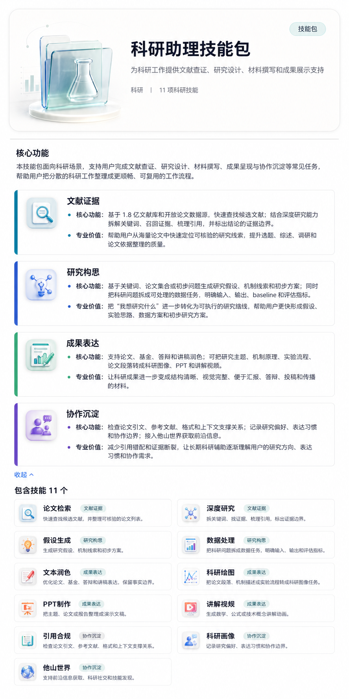

# 他山科研技能库

[English README](README.md)

他山科研技能库是一个中英文科研助手 skills 仓库，用于托管文献检索、证据核验、研究构思、科研写作、科研绘图、PPT 制作、引用审查和长期科研协作工作流。

本项目由 **磐石 AI4Science 生态与应用模式研究项目** 支持。



## 项目概览

当前仓库共包含 **12 个 skills**。每个 skill 都是一个独立工作流目录，入口文件为 `SKILL.md`，必要时配套 `scripts/`、`references/`、`templates/`、`examples/` 或 `assets/`。

这些 skills 按四类科研任务组织：

| 模块 | 支持内容 | 包含技能 |
| --- | --- | --- |
| 文献证据 | 论文检索、证据召回、结论追踪、论文审查和证据边界核验。 | 论文检索、深度研究、论文审查 |
| 研究构思 | 把主题、论文集合或初步问题转成假设、机制线索、数据任务、baseline 和评估方案。 | Scispark、Research Baseline Builder |
| 成果表达 | 改进科研写作，并生成科研图像、PPT 和技术讲解视频。 | 科研文本润色、科研绘图、Visual Deck Builder、Manim Agent |
| 协作沉淀 | 引用合规、偏好记忆和长期科研协作工作流。 | PaperCheck、科研画像、他山世界 |

## 包含技能

| 技能 | 路径 | 用途 |
| --- | --- | --- |
| 论文检索 | [`skills/giiisp-paper-search-apis`](skills/giiisp-paper-search-apis/SKILL.md) | 基于 Giiisp 和开放论文数据源，快速查找候选文献，并整理可核验的论文列表。 |
| 深度研究 | [`skills/sci-employee-deep-research`](skills/sci-employee-deep-research/SKILL.md) | 围绕研究问题拆关键词、找证据、梳理引用，并标出结论的证据边界。 |
| 论文审查 | [`skills/thesis-audit-reviewer`](skills/thesis-audit-reviewer/SKILL.md) | 审查论文或学位论文中的事实、方法、引用、证据边界和完成度。 |
| Scispark | [`skills/scispark`](skills/scispark/SKILL.md) | 基于关键词或论文集合生成带证据追踪的研究想法、假设和机制线索。 |
| Research Baseline Builder | [`skills/research-baseline-builder`](skills/research-baseline-builder/SKILL.md) | 把科研问题拆成可处理的数据任务，明确输入、输出、baseline 和评估指标。 |
| 科研文本润色 | [`skills/scientific-humanization`](skills/scientific-humanization/SKILL.md) | 优化中文论文、基金、答辩和讲稿表达，让文字更自然，同时保留事实边界。 |
| 科研绘图 | [`skills/giiisp-scientific-image-generation`](skills/giiisp-scientific-image-generation/SKILL.md) | 把论文段落、机制描述或实验流程转成科研图像生成任务。 |
| PPT 制作 | [`skills/visual-deck-builder`](skills/visual-deck-builder/SKILL.md) | 把主题、论文、报告或笔记整理成结构清晰、视觉完整的演示文稿。 |
| 讲解视频 | [`skills/manim-agent`](skills/manim-agent/SKILL.md) | 生成数学、公式或技术概念的讲解动画，可按需要加入配音。 |
| 引用合规 | [`skills/papercheck`](skills/papercheck/SKILL.md) | 检查论文引文、参考文献、格式和上下文支撑关系。 |
| 科研画像 | [`skills/cognitive-profile`](skills/cognitive-profile/SKILL.md) | 记录研究偏好、表达习惯和协作边界，让长期辅助更贴合个人风格。 |
| 他山世界 | [`skills/world-threads-entry`](skills/world-threads-entry/SKILL.md) | 接入 TopicLab / 他山世界 / OpenClaw，支持前沿信息获取和科研协作。 |

更多中文能力说明见 [`docs/skill-package-overview.md`](docs/skill-package-overview.md)。

## 作者与支持

**作者与贡献者**

- 乔晗
- 朱晓墨
- Yu-Yang Li
- 蔡安平
- 王瑞
- 房泽锐
- OpenAI Codex 辅助开发贡献者

**支持项目**

- 磐石 AI4Science 生态与应用模式研究项目

## 仓库结构

```text
.
├── assets/                  # README 和文档使用的公开图片
├── docs/                    # 面向用户阅读的技能包说明
├── skills/                  # skill 目录，每个目录以 SKILL.md 为入口
├── .github/                 # issue 和 PR 模板
├── CONTRIBUTING.md          # 协作规则
├── SECURITY.md              # 密钥和安全策略
├── LICENSE                  # MIT License
├── README.md                # 英文 README
└── README.zh-CN.md          # 中文 README
```

## 使用方式

每个 skill 都是自包含目录。使用时先阅读对应目录下的 `SKILL.md`，再按其中引用的 `scripts/`、`references/`、`templates/` 或 `assets/` 执行。

本地查看：

```powershell
git clone https://github.com/Yu-Yang-Li/tashan-research-skills.git
cd tashan-research-skills
Get-ChildItem .\skills -Recurse -Filter SKILL.md
```

把某个 skill 安装到本机 Codex skills 目录：

```powershell
Copy-Item -Recurse .\skills\papercheck "$env:USERPROFILE\.codex\skills\papercheck"
```

把 `papercheck` 换成需要安装的 skill 目录名即可。

## 工程标准

这个仓库要保持可审查、可维护，避免变成不可维护的代码堆：

- 每个 skill 只负责一个清晰的科研任务。
- 可复用脚本放在所属 skill 的 `scripts/` 目录。
- 优先使用 Markdown 说明和结构化 manifest，不依赖大块二进制文档作为唯一信息源。
- 不提交生成运行目录、原始模型日志、私有论文、密钥或本地缓存。
- 修改脚本时，提供 smoke test 或可复现的手工验证命令。
- 修改 skill 行为时，同步更新对应 `SKILL.md` 和相关引用文档。

## 密钥策略

不要把 API key、access token、bind key、cookie、SSH 私钥或服务凭证写入仓库。

需要外部服务的 skill 必须从环境变量或本地用户配置读取密钥。常见环境变量包括 `GIIISP_AUTH_TOKEN`、`DASHSCOPE_API_KEY`、`OPENAI_API_KEY`、`ANTHROPIC_AUTH_TOKEN` 和 `MINERU_API_TOKEN`。

## 许可证

本项目采用 [MIT License](LICENSE)。
